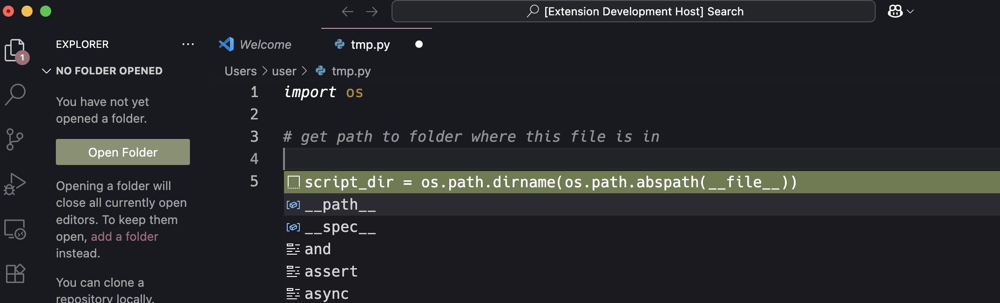

# LineCompletion

Add LLM suggestions to vscode intellisense (ctrl+space) suggestions.



### Dev Setup

Set GEMINI_API_KEY environment variable.

Install Backend
```
cd backend
python -m venv venv
. venv/bin/activate
pip install -r requirements.txt
```

Run Backend:
```
cd backend
python main.py
```

Run VSCode Frontend:
- In VSCode, press F5 or go to 'Run and Debug' -> 'Run Extension' Green Play Button
